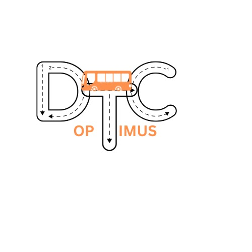

# Team-42

<p align="center">
  
</p>

<h1 align="center">DTC-OPTIMUS</h1>

<p align="center">
  <strong>Automated Bus Scheduling and Route Management System</strong>
</p>

## Table of Contents

- [Team-42](#team-42)
  - [Table of Contents](#table-of-contents)
  - [Introduction](#introduction)
  - [Problem Statement](#problem-statement)
  - [Technology Stack](#technology-stack)
  - [Screenshots](#screenshots)
  - [Features](#features)
  - [Installation](#installation)

## Introduction

**DTC-OPTIMUS** is a comprehensive software solution designed to automate various aspects of bus scheduling and route management for the Delhi Transport Corporation (DTC). The Automated Bus Scheduling and Route Management System will utilize algorithms, data analytics, and geographic information system (GIS) technologies to automate various aspects of bus scheduling and route management. The project aims to develop a comprehensive software solution to streamline bus scheduling, optimize resource utilization, and improve route planning.

## Problem Statement


Efficient bus scheduling and route planning are essential for the smooth operation of public bus transport services. Currently, the Delhi Transport Corporation (DTC) relies on manual methods for scheduling and planning, which are time-consuming and resource-intensive. To improve operational efficiency, reduce errors, and enhance service reliability, DTC needs an automated software solution capable of handling both linked and unlinked duty scheduling, facilitate route management by mapping all existing routes and highlighting overlaps with proposed new routes.

## Technology Stack


## Screenshots

## Features

- [x] **Linked Duty Scheduling:** Assign crews to specific buses for their entire shifts.
- [x] **Unlinked Duty Scheduling:** Allow crews to switch bus between trips and manage rest periods.
- [x] **Route Management:** Map existing routes, and optimize for congestion and coverage.
- [x] **Optimized routes:** GIS mapping and route planning.

## Installation

To set up the project locally:

1. Clone the repository:

```bash
git clone https://github.com/ITER-SIH/HW5-Team42.git
cd HW5-Team42
```
